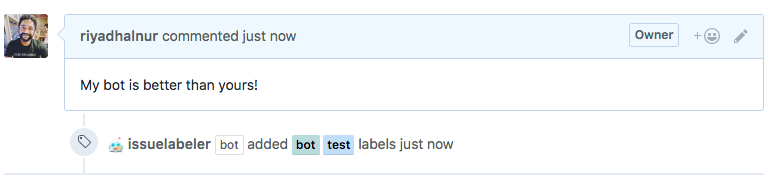

# issuelabeler  

[](https://greenkeeper.io/)

  

[](https://travis-ci.org/riyadhalnur/issuelabeler) [](https://snyk.io/test/github/riyadhalnur/issuelabeler?targetFile=package.json)  

> A GitHub bot to label issues automatically based on title and body against list of defined labels. Built with [probot](https://github.com/probot/probot).  

  

### Installation  
After installation, create `.github/labeler.yml` in the default branch to enable it:

```yml
# Number of labels to fetch (optional). Defaults to 20
numLabels: 40
# These labels will not be used even if the issue contains them
excludeLabels:
  - pinned
```  

### Contributing  
Read the [CONTRIBUTING](CONTRIBUTING.md) guide for information.  

### License  
Licensed under MIT. See [LICENSE](LICENSE) for more information.  

Logo built using [Streamline Emoji](http://emoji.streamlineicons.com) by [@webalys](https://twitter.com/webalys) under the Creative Common Attribution licence.  

### Issues  
Report a bug in [issues](https://github.com/riyadhalnur/npm-modules-sync/issues).   

Made with love in Kuala Lumpur, Malaysia by [Riyadh Al Nur](https://verticalaxisbd.com)  
